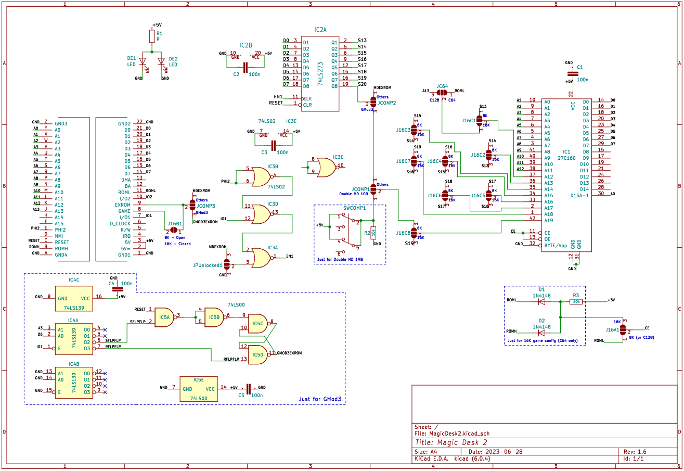

# Magic Desk 2
Open Hardware Project to build a 3 in 1 cartridge based on Magic Desk 1MB and Universal c64 Cartridge by Marko Šolajić

3 Different configuratios
-------------------------
- **Magic Desk 16Kbyte config**
- **Double Magic Desk 1MB**
- **GMod3 2MB Read Only cartridge**

Magic Desk 16Kbyte config
-------------------------
Old Magic Desk Cartridge could be:
- standard [32Kb (4 banks), 64Kb (8 banks) and 128Kb (16 banks)]
- DDI Magic Cart [32 banks, 256kb]
- Magic Desk Clone homebrew cart [64 banks, 512kb and 128banks, 1MB]

Furthermore:
- ROM is always mapped in at $8000-$9FFF (8k game)
- 1 register at IO1 / $DE00
   - bit 0-6   bank number
   - bit 7     exrom (1 = cart disabled)

**Magic Desk 16Kbyte config**
- supports all "Magic Desk Clone" homebrew cart with 16k game config, up to 2 MB
- ROM is always mapped in at $8000-$BFFF (16k game)
- 1 register at io1 / de00
   - bit 0-6   bank number
   - bit 7     exrom (1 = cart disabled)

So, 128 banks and one bank is 16Kbyte: 2MByte of ROM space.

Double Magic Desk 1MB
---------------------
You can put 2 different 1MByte bin images inside 27C160 EPROM (from $000000 to $0FFFFF and from $100000 to $1FFFFF) and select them using SWCOMP1 switch like 2 different sides of a magnetic tape data storage. Bin files can be made using [Magic Desk Cartridge Generator](https://bitbucket.org/zzarko/magic-desk-cartridge-generator/), as usual.

GMod3 2MB Read Only cartridge
-----------------------------
You can configure this cartridge to partially follow the functional specifications of the [GMod3 (Individual Computers)](http://wiki.icomp.de/wiki/GMod3) cartridge type:
- 2MB of ROM space
- ROM is always mapped in at $8000-$9FFF (8k game)
- No Write capability
- Register at IO1 / $DE00
   - bit 0-7   bank number (256 banks)
- Register at $DE08
   - bit6 EXROM (to disable cartridge)
- No bitbang mode

Magic Desk Cartridge Generator will be modded to make 2Mbyte GMod3 bin images of games compilation.

Componets
---------
**All configurations**
- 27C160 [IC1]
- 74LS273 (or 74HCT273) [IC2]
- 74LS02 (or 74HCT02) [IC3]
- 100nF x3 [C1, C2, C5]

 

**Magic Desk 16Kbyte only**
- 10K Ω [R3]
- 1N4148 x2 [D1, D2]

 

**GMod3 2MB only**
- 74LS175 (or 74HCT175) [IC4]
- 10K Ω x2 [R4]
- 1N4148 x2 [D3, D4]
- 100nF [C4]

 

**Double Magic Desk 1MB only**
- Push Button On Off Self Lock UnLock Switch DIP 6 Pin 7x7mm [SWCOMP1]
- 10K Ω [R2]

 

**Optional lighting eyes (all configurations)**
- SMD led x2 [DE1, DE2]
- From 400 to 1K Ω [R1]

