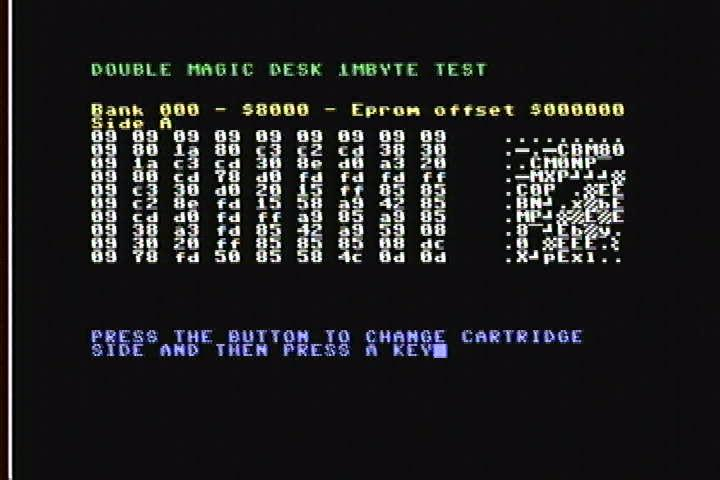

# Magic Desk 2
A Project to build a 3 in 1 Commodore 64 cartridge, based on Magic Desk 1MB and Universal c64 Cartridge by Marko Šolajić.  
Due to the low cost and availability of 27c160 EPROMs nowadays, building a cartridge with 2MByte of ROM is easy to do. Furthermore, the 27c160 EPROMs can be 8 bits addressed and, given the amount of pins, being THT is an advantage.

3 Different configurations
-------------------------
- **Magic Desk 16Kbyte config**
- **Double Magic Desk 1MB**
- **GMod3 2MB Read Only cartridge**

Magic Desk 16Kbyte config
-------------------------
Old Magic Desk Cartridge could be:
- Standard [32Kb (4 banks), 64Kb (8 banks) and 128Kb (16 banks)]
- DDI Magic Cart [32 banks, 256kb]
- Magic Desk Clone homebrew cart [64 banks, 512kb and 128banks, 1MB]

Furthermore:
- ROM is always mapped in at $8000-$9FFF (8k game)
- 1 register at IO1 / $DE00
   - bit 0-6   bank number
   - bit 7     EXROM (1 = cart disabled)

**Magic Desk 16Kbyte config**
- supports all "Magic Desk Clone" homebrew cart with 16k game config, up to 2 MB
- ROM is always mapped in at $8000-$BFFF (16k game)
- 1 register at IO1 / $DE00
   - bit 0-6   bank number
   - bit 7     EXROM (1 = cart disabled)

So, 128 banks and one bank is 16Kbyte: 2MByte of ROM space.

Double Magic Desk 1MB
---------------------
You can put 2 different 1MByte bin images inside 27C160 EPROM (from $000000 to $0FFFFF and from $100000 to $1FFFFF) and select them using SWCOMP1 (or JP1) switch like 2 different sides of a magnetic tape data storage. Bin files can be made using [Magic Desk Cartridge Generator](https://bitbucket.org/zzarko/magic-desk-cartridge-generator/), as usual.

GMod3 2MB Read Only cartridge
-----------------------------
You can configure this cartridge to partially follow the functional specifications of the [GMod3 (Individual Computers)](http://wiki.icomp.de/wiki/GMod3) cartridge type:
- 2MB of ROM space
- ROM is always mapped in at $8000-$9FFF (8k game)
- No Write capability
- Register at IO1 / $DE00
   - bit 0-7   bank number (256 banks)
- Register at $DE08
   - bit 6 EXROM (1 = cart disabled)
- No bitbang mode

You can use the new [Magic Cartridge Generator](https://bitbucket.org/zzarko/magic-cartridge-generator) (by Žarko Živanov) to make 2Mbyte GMod3 bin images of games compilation.

Componets
---------
**All configurations**
- 27C160 (DIP_42) [IC1]
- 74LS273 (or 74HCT273) (SOP_20) [IC2]
- 74LS02 (or 74HCT02) (SO_14) [IC3]
- 100nF (SMD_0805) x3 [C1, C2, C3]

 

**Magic Desk 16Kbyte only**
- 10K Ω (SMD_1206) [R3]
- 1N4148 (SMD_0805) x2 [D1, D2]
(For Commodore 128 don't put R3, D1and D2, they are irrelevant)
 

**GMod3 2MB only**
- 74LS139 (or 74HCT139) (SO_14) [IC4]
- 74LS00 (or 74HCT00) (SO_14) [IC5]
- 100nF (SMD_0805) x2 [C4, C5]

 

**Double Magic Desk 1MB only**
- Push Button On Off Self Lock UnLock Switch DIP 6 Pin 7x7mm [SWCOMP1]
  - or alternatively any kind of on/off switch connected to JP1
- 10K Ω (SMD_1206) [R2]

 

**Optional lighting eyes (all configurations)**
- SMD led (SMD_0603) x2 [DE1, DE2] (UP/DOWN reverse mounted to see the light through the hole)
- From 400 to 1K Ω (SMD_1206) [R1]

**Appareance**

||
|:---:|
||

**Images**
|||
|:---:|:---|
|||
|||
|||
|||

Jumper configuration
--------------------
**Magic Desk 16Kbyte config (Commodore 64)**

| JCOMP1 | JCOMP2 | JCOMP3 | J16A1 | J16B1 | J16C1-8|JC64|
|:---:|:---:|:---:|:---:|:---:|:---:|:---:|
|Short 2 and 3|Short 1 and 2|Short 1 and 2|Short 2 and 3|Closed|Short 2 and 3|Short 1 and 2|
||||||||

(Put D1, D2 and R3)

 

**Magic Desk 16Kbyte config (Commodore 128)**

| JCOMP1 | JCOMP2 | JCOMP3 | J16A1 | J16B1 | J16C1-8|JC64|
|:---:|:---:|:---:|:---:|:---:|:---:|:---:|
|Short 2 and 3|Short 1 and 2|Short 1 and 2|Short 1 and 2|Open|Short 2 and 3|Short 2 and 3|
||||||||

(Put D1, D2 and R3)

 

**Double Magic Desk 1MB**

| JCOMP1 | JCOMP2 | JCOMP3 | J16A1 | J16B1 | J16C1-8|JC64|
|:---:|:---:|:---:|:---:|:---:|:---:|:---:|
|Short 1 and 2|Short 1 and 2|Short 1 and 2|Short 1 and 2|Open|Short 1 and 2|Short 1 and 2|
||||||||

(Put SWCOMP1 and R2)

 

**GMod3 2MB Read Only cartridge**

| JCOMP1 | JCOMP2 | JCOMP3 | J16A1 | J16B1 | J16C1-8|JC64|
|:---:|:---:|:---:|:---:|:---:|:---:|:---:|
|Short 2 and 3|Short 2 and 3|Short 2 and 3|Short 1 and 2|Open|Short 1 and 2|Short 1 and 2|
||||||||

(Put IC4, IC5, R4, R5, D3, D4, D5, D6, C4 and C5)

 

**All configurations**

|JPUnlocked1| |
|:---|-|
|By shorting 1 and 2 it will be possible to disable and enable the cartridge using the EXROM register ($DE08 - bit 6 for GMod3, $DE00 - bit 7 for Magic Desk cartridges)||
|By shorting 2 and 3 it will be possible only to disable the cartridge using the EXROM register||

 

Thanks to:
----------
- Žarko Živanov, for creating the Magic Desk Cartridge Generator
- Marko Šolajić, for creating some Magic Desk Clone homebrew cartridge
- Individual Computers for GMod3 specifications

**Soon will be available gerbers and schematics**

PCB
---
If you dont want wait, can get pcb right now at [PCBWay](https://www.pcbway.com/project/shareproject/Magic_Desk_2_for_Commodore_64_62898d63.html)

